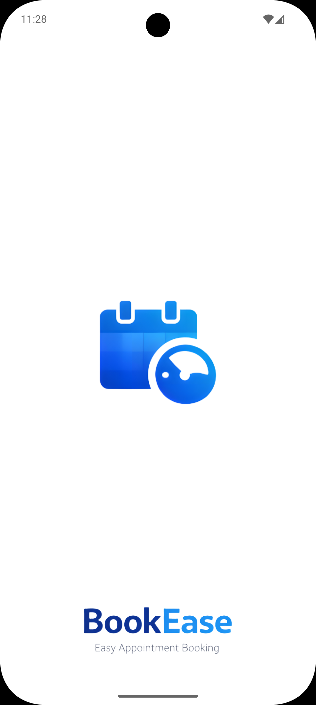
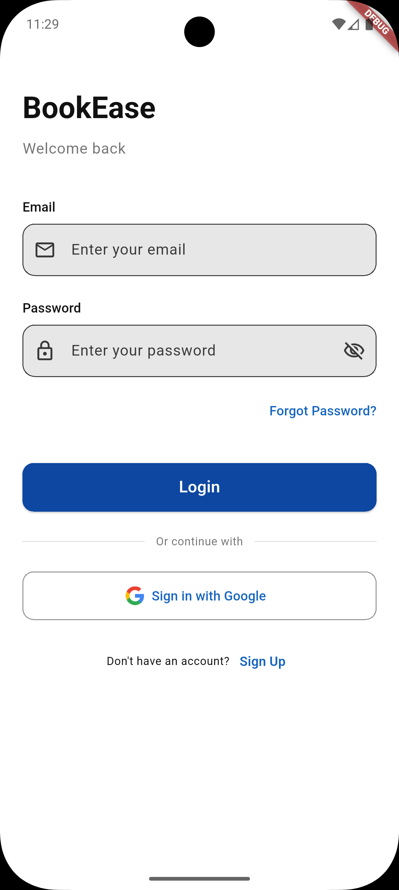
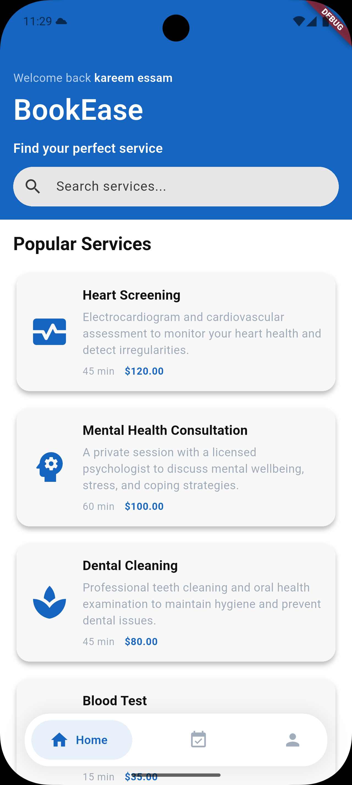
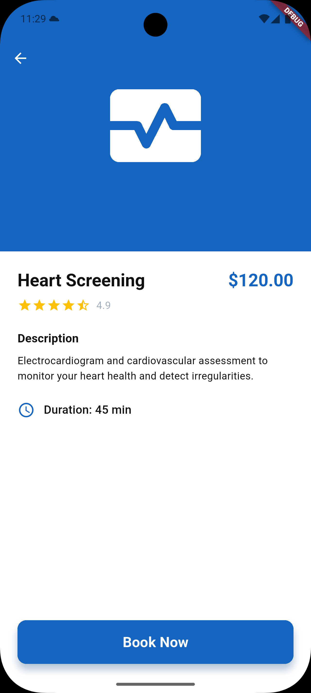
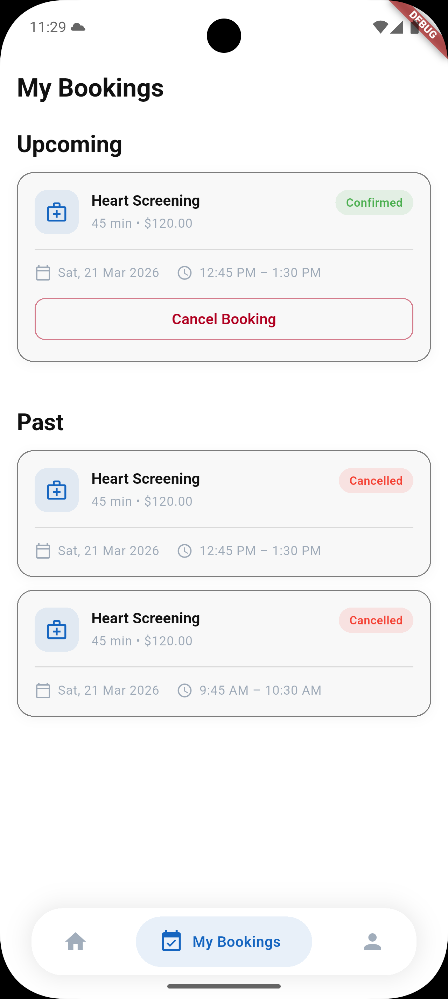
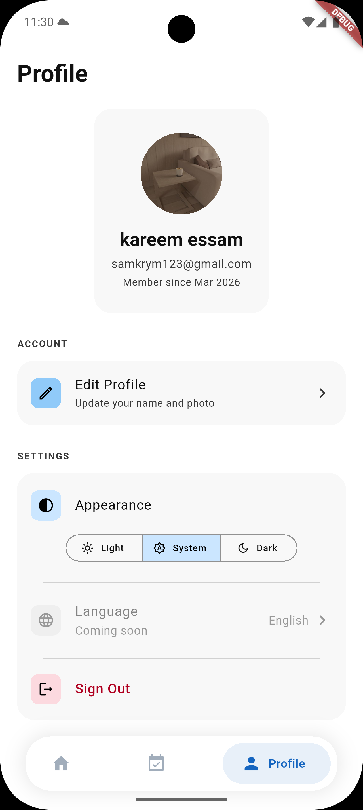
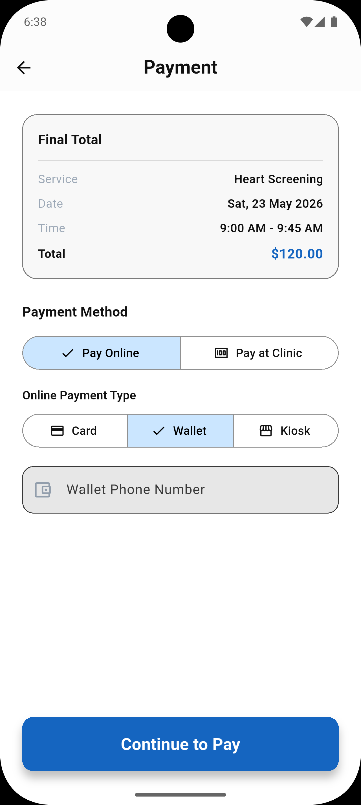
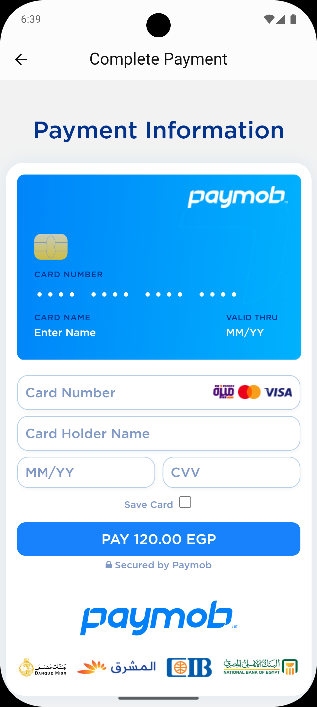
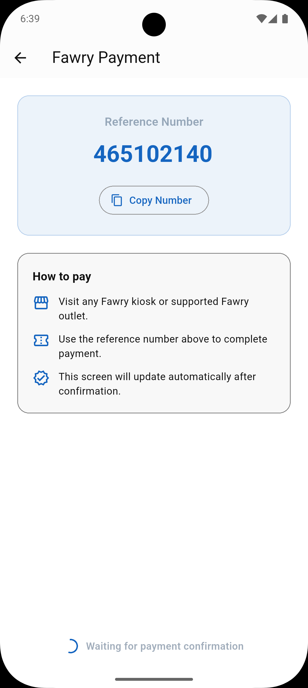

# BookEase — Appointment Booking App

A full-featured Flutter mobile application for booking clinic appointments, built as a portfolio project demonstrating production-level architecture, Firebase integration, and real-world booking system design.

## Screenshots

| Splash | Login | Home |
|---|---|---|
|  |  |  |

| Service Details | Bookings | Profile |
|---|---|---|
|  |  |  |

| Payment Method | Card Checkout | Kiosk |
|---|---|---|
|  |  |  |

## Features

### Customer App
- 📅 **Smart Booking Flow** — Browse services, pick an available date and time slot, confirm appointment details
- 💳 **Secure Payments (Paymob)** — Integrated payment gateway supporting Credit/Debit Cards, Mobile Wallets, Cash collection, and Kiosk payments.
- 🔒 **Double-booking Prevention** — Transactional slot reservation using a `daily_slots` concurrency control document in Firestore
- 📋 **My Bookings** — View upcoming and past appointments, cancel confirmed bookings with automatic slot release
- 🔔 **Appointment Reminder Notifications** — Push reminder is sent shortly before confirmed appointments via Firebase Cloud Messaging
- 🔍 **Service Search** — Real-time client-side filtering of available clinic services
- 👤 **Profile Management** — Edit display name and profile photo (Firebase Storage), change password (email users only)
- 🌙 **Theme Support** — Light, dark, and system theme modes with persistent preference
- 🔐 **Authentication** — Email/password and Google Sign-In with secure session management

### Technical Highlights
- Slot generation algorithm that calculates availability in minutes-since-midnight, correctly handling back-to-back appointments and partial overlaps
- Firestore transactions for atomic booking creation and cancellation
- Paymob integration via Cloud Functions for secure order creation, HMAC webhook validation, and automated pending payment expiry
- Automated reminder pipeline using Firestore trigger + Cloud Tasks queue + Firebase Cloud Messaging
- Role-aware UI (Google vs email/password users see different options)
- Auth-gated navigation with onboarding completion tracking via SharedPreferences

## Tech Stack

| Category | Technology |
|---|---|
| Framework | Flutter |
| State Management | flutter_bloc (Cubit) |
| Navigation | GoRouter |
| Backend | Firebase (Auth, Firestore, Storage) |
| UI | FlexColorScheme, ScreenUtil, GoogleNavBar |
| Utilities | intl, image_picker, image_cropper, shared_preferences, flutter_secure_storage |

## Architecture

The app follows **Clean Architecture** with a **feature-first** folder structure. Each feature encapsulates its own `data/` (repositories) and `presentation/` (screens, widgets, state management) layers.

```
lib/
├── core/               # Shared infrastructure
│   ├── exceptions/     # Unified error types
│   ├── helpers/        # Utilities, validators, formatters
│   ├── models/         # Shared models (Booking, Service, Result)
│   ├── routing/        # GoRouter config and route names
│   ├── services/       # Firebase & native service abstractions
│   ├── theme/          # ThemeCubit and ThemeData
│   └── widgets/        # Shared UI components
│
└── features/
    ├── auth/           # Login, signup, Google Sign-In
    ├── booking/        # Booking wizard, slot generation, repositories
    ├── home/           # Service catalog, search, service details
    ├── my_bookings/    # Booking history, cancellation
    ├── onboarding/     # First-launch carousel
    ├── payment/        # Paymob integration (Card, Wallet, Kiosk screens)
    ├── profile/        # Account management, theme settings
    └── root/           # App shell, bottom nav, splash
```

### Key Patterns
- **Repository Pattern** — All Firestore and Auth operations are abstracted behind repository classes injected via `MultiBlocProvider`
- **Result\<T\>** — Every repository method returns a `Result<T>` (Success/Failure) ensuring no unhandled exceptions reach the UI layer
- **Cubit** — Lightweight state management with sealed state classes per feature
- **ShellRoute** — Booking flow shares a single `BookingCubit` instance across three screens via GoRouter's `ShellRoute`

## Screens

| Screen | Purpose |
|---|---|
| Splash | Boot gate, redirects based on auth and onboarding state |
| Onboarding | 3-slide first-launch walkthrough |
| Auth | Login / registration with Google Sign-In |
| Home | Service catalog with search |
| Service Details | Full service info with Book Now CTA |
| Booking Calendar | Date picker + dynamic time slot grid |
| Booking Details | Customer info form + booking summary |
| Payment Method | Choose between Card, Wallet, Kiosk, or Cash |
| Payment Checkout | Secure Paymob card iframe or Wallet/Kiosk instructions |
| Booking Success | Confirmation receipt |
| My Bookings | Upcoming and past appointments |
| All Bookings | Full booking history list |
| Profile | Account info and settings |
| Edit Profile | Name and photo update |
| Change Password | Secure password update (email users only) |

## Firebase Setup

The app uses the following Firebase services:
- **Firebase Auth** — Email/password and Google Sign-In
- **Cloud Firestore** — Services catalog, bookings, clinic schedule, daily slot concurrency control, user profiles
- **Firebase Storage** — Profile photo uploads
- **Firebase Cloud Messaging (FCM)** — Push notifications for appointment reminders
- **Cloud Functions + Cloud Tasks** — Scheduled reminder dispatch after booking creation

### Firestore Collections
| Collection | Purpose |
|---|---|
| `users/{uid}` | User profile documents + FCM token storage |
| `services/{id}` | Clinic service catalog |
| `clinic_schedule/{dayOfWeek}` | Working hours per day (1=Mon, 7=Sun) |
| `bookings/{id}` | Appointment records |
| `daily_slots/{date}` | Booked time intervals for concurrency control |

## Getting Started

### Prerequisites
- Flutter SDK
- Firebase project with Auth, Firestore, and Storage enabled
- `google-services.json` placed in `android/app/`

### Run the app
```bash
flutter pub get
flutter run
```


## Related Project — Staff Dashboard (React)

The admin dashboard is completed and maintained as a separate frontend that shares the same Firebase backend as this Flutter app.

- **GitHub:** [bookease-dashboard](https://github.com/Kareem-Mahfouz1/bookease-dashboard)
- **Live:** [bookease-39d4d.web.app](https://bookease-39d4d.web.app/)

### Dashboard Highlights
- **Dashboard** — Today's KPIs (bookings, confirmed, cancelled, revenue), weekly chart, progress ring, and today's appointments actions
- **Bookings** — Full history with filters, expandable details, and staff actions (complete / no-show / cancel)
- **Services** — Full CRUD, Firebase Storage image upload, active/inactive toggle, icon selector
- **Schedule** — Weekly clinic hours management synced to booking availability
- **Access Control** — Auth + role guard (`role: 'staff'`)

### Dashboard Stack
| Category | Technology |
|---|---|
| Framework | React 19 + TypeScript |
| Build Tool | Vite |
| Styling | Tailwind CSS v3 |
| Routing | React Router v7 |
| Data Fetching | TanStack Query v5 |
| Backend | Firebase (Auth, Firestore, Storage) |
| Charts | Recharts |

### Mobile vs Dashboard
| App | Primary Users | Responsibilities |
|---|---|---|
| Flutter App | Customers | Create and manage their own bookings |
| React Dashboard | Clinic Staff | Manage all bookings, services, and schedule |